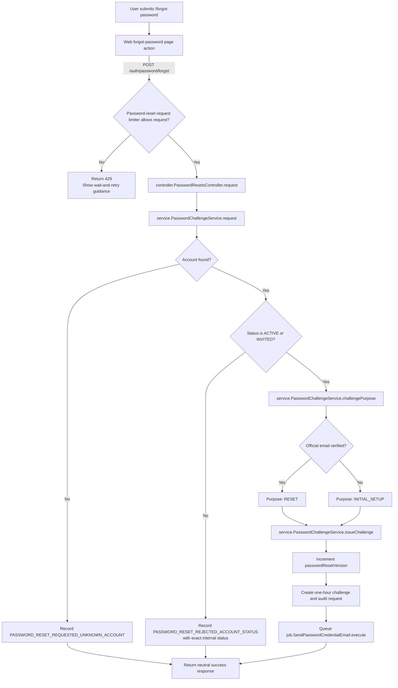
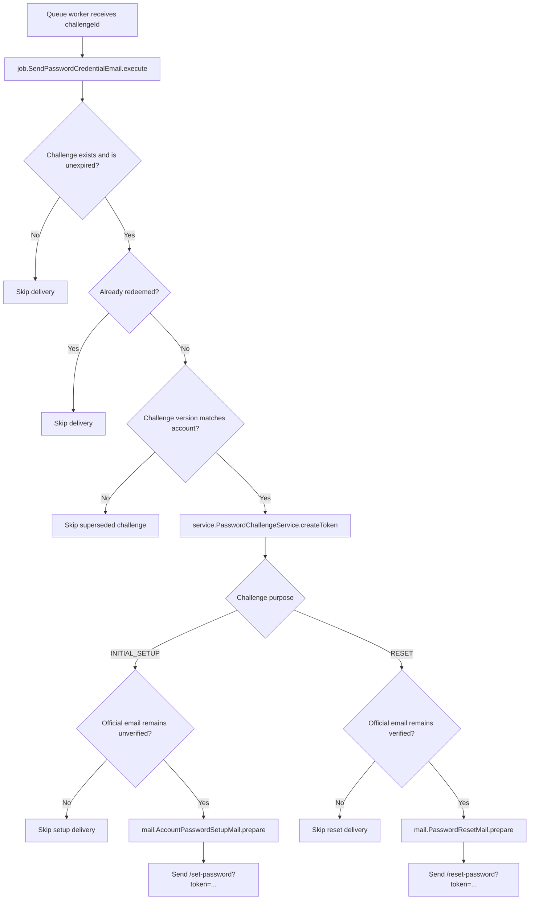
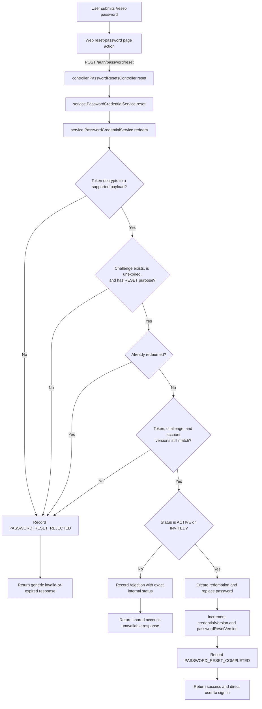
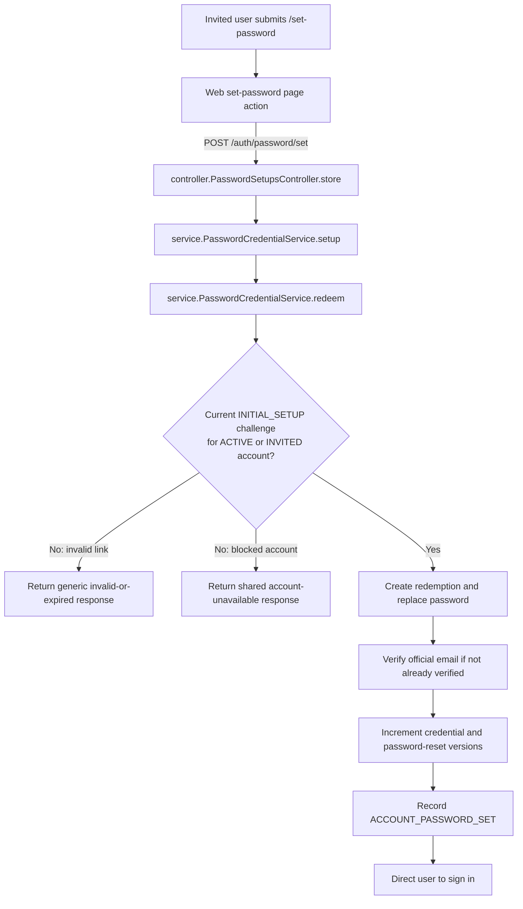
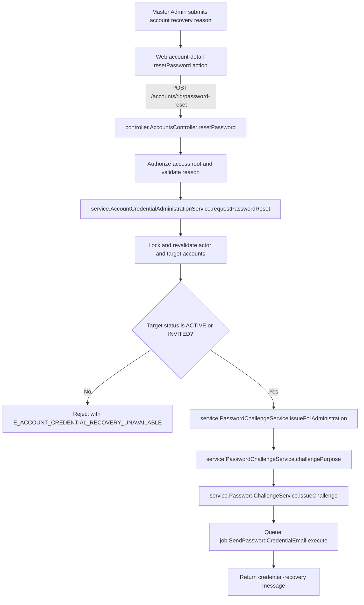

# Password Reset and Initial Setup Flows

This document traces the implemented credential-recovery workflow from the web
interface through the API, email queue, and credential-redemption boundary. It
is written for developers and preserves security-relevant branches that may be
condensed in onboarding or demonstration material.

## Scope and governing rules

- Anonymous recovery that passes the request limiter always returns the same
  neutral response, whether the submitted email is unknown, active, invited,
  suspended, or deactivated.
- A rate-limited request stops before the controller, creates no challenge, and
  receives explicit wait-and-retry guidance.
- Only `ACTIVE` and `INVITED` accounts may receive or redeem credential
  challenges.
- A verified person receives a `RESET` challenge. An unverified person receives
  an `INITIAL_SETUP` challenge.
- Challenges are purpose-bound, one-hour, single-use, and supersedable.
- Suspension and deactivation increment the account's password-reset version,
  invalidating previously issued challenges.
- Redemption locks and rechecks the challenge and account before changing a
  password.
- Public responses do not expose whether a blocked account is suspended or
  deactivated. Audit events retain the exact status.

## 1. Forgot-password request

The response shown for every controller branch is:

> If an account uses that email, a password reset link will be sent.

The rate-limited branch never reaches the controller and therefore does not
show the neutral response. The controller queues email work only when the
service returns a challenge. Queue-dispatch failure is logged but does not
change the neutral public response or roll back the committed challenge.

## 2. Queued credential email

The durable queue payload contains only the challenge ID. The encrypted token
is created by the worker immediately before email delivery and is never stored
as readable application data.

## 3. Password-reset redemption

Malformed, missing, expired, wrong-purpose, redeemed, and superseded challenges
share the invalid-or-expired response. A current challenge whose account is
blocked receives:

> This account cannot currently sign in. Contact administrator.

## 4. Initial password setup redemption

The initial-setup endpoint uses the same locked redemption service with a
different required purpose and completion event.

Setting the password does not create a session. The first successful login
performs the accepted `INVITED` to `ACTIVE` transition.

## 5. Administrative credential recovery

The web account-detail page does not offer credential recovery for suspended or
deactivated accounts. The API check remains authoritative for direct requests
and pages made stale by a concurrent lifecycle change. The administrator never
supplies, receives, or learns the account holder's password or recovery token.

## Status and outcome matrix

| Account state | Sign in with correct password | Anonymous recovery request | Administrative recovery | Redeem current challenge |
| --- | --- | --- | --- | --- |
| `INVITED` | Allowed; activates account | Issues setup or reset challenge according to email verification | Allowed | Allowed |
| `ACTIVE` | Allowed | Issues reset challenge | Allowed | Allowed |
| `SUSPENDED` | Shared account-unavailable message | Neutral response; no challenge | Rejected | Shared account-unavailable message |
| `DEACTIVATED` | Shared account-unavailable message | Neutral response; no challenge | Rejected | Shared account-unavailable message |
| Unknown email | Invalid credentials | Neutral response; no challenge | Not applicable | Not applicable |

## Deriving simplified user flows

Onboarding and demonstration flows may collapse implementation participants but
must preserve the following user-visible behavior:

| Developer flow | Simplified user-flow step | Details that may remain internal |
| --- | --- | --- |
| Forgot-password request | Enter official email and submit | Account lookup, neutral branching, audit event type, and challenge version |
| Queued delivery | Check official email and open the link within one hour | Queue payload, token creation timing, and delivery skip checks |
| Reset redemption | Choose a new password, then sign in | Transaction locks, redemption record, credential versions, and audit metadata |
| Initial setup | Set the first password, then sign in | Shared redemption service and `INVITED` to `ACTIVE` activation timing |
| Blocked account | Contact administrator | Exact suspended/deactivated status remains internal in public authentication flows |
| Administrative recovery | Administrator requests a holder-controlled link | Root-authority locking, challenge purpose selection, and queue dispatch |

Do not simplify the neutral forgot-password response into confirmation that an
account exists or that an email was sent. Do not portray an administrator as
setting or receiving another person's password. Keep rate-limit guidance
distinct from the neutral accepted-request response because a rate-limited
request creates no challenge.
